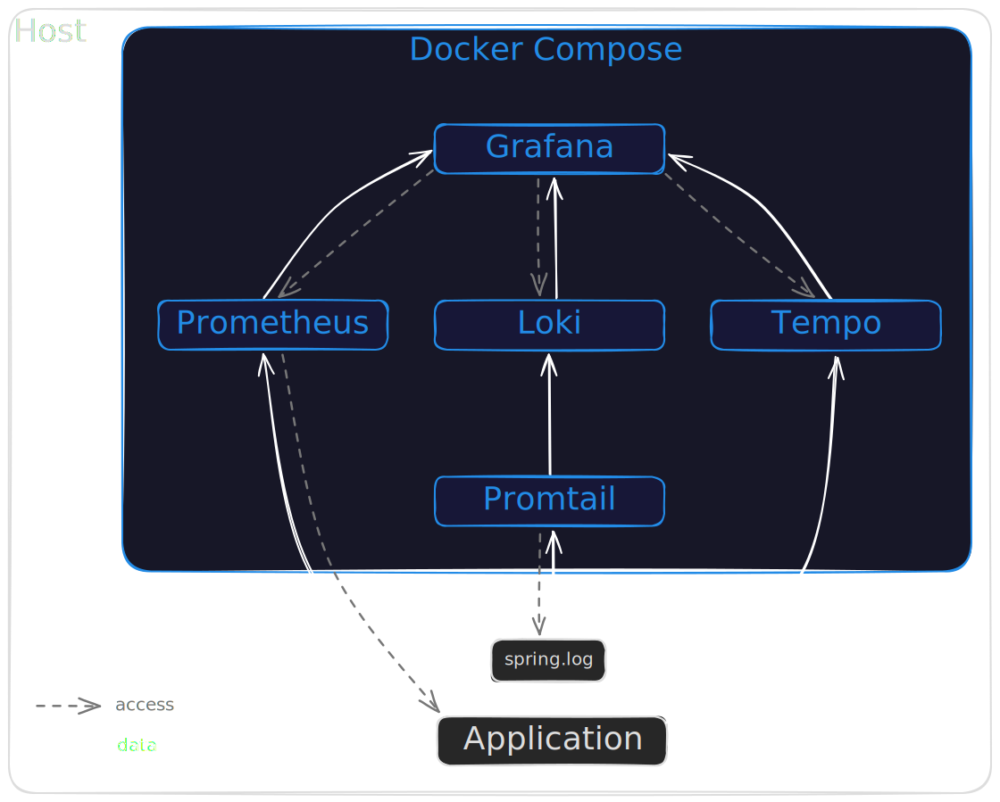

= Dev/prod parity for your favourite observability stack

This repository contains the source code of my little demo project -- a very simple https://spring.io/projects/spring-boot[Spring Boot] application accompanied by a locally running observability stack provided with https://docs.docker.com/compose/[Docker Compose]:

== Slides

The source code of my slides (created with https://github.com/asciidoctor/asciidoctor-reveal.js[asciidoctor-reveal.js]) is also included link:./slides[here].
